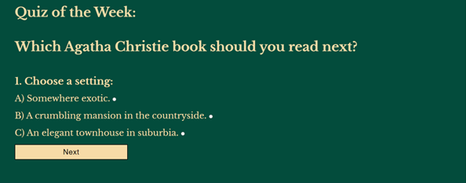

# **Christie Quizzes**

Christie Quizzes is a website which is aimed at fans of the crime writer Agatha Christie. On the site, visitors can take quizzes They can read news and updates regarding adaptions of her work, talks about her novels and meet ups for her fans.

## **UX**

#### **Colour scheme**

The colours 034C3C (Blue Green Colour Wheel), F7DBA7 (Navajo White) and 2C2A4A (Space Cadet) were chosen as they complemented the theme of the website but also worked well with regards to readability and accessibility.

#### **Typography- fonts and imagery**

Libre Baskerville 400 & 700 were selected as the font for the headings and body of the website due to its Gothic style. It is from [Google Fonts](https://fonts.google.com/specimen/Libre+Baskerville).

## **Features**

### Existing features

####  Header

This part of the site lets visitors know what the site is about and who it's aimed at.

#### News section

This section features news and updates. Each item of news features a relevant icon: a film camera for an adaption, a speech bubble for a talk by an expert and a calendar for an event the visitor may be interested in.

#### Sign up form

The sign up feature enables to visitor to sign up for a newsletter.

#### Newsletter confirmation

This page confirms to the user that the site has received their data and they've been added to the mailing list.

#### Quiz section

In the 'Quiz of the week' section, the visitor can take a quiz which recommends a book for them to read. The quiz is hidden until the quiz taker clicks on the 'Start Quiz' button. 

The quizzer is then taken through seven multiple choice questions.

#### Results section

After the final question, the quiz taker is presented with the 'Calculate Results'. 

)

The viewer receives a recommendation for a book based on their answers.

#### Footer

The footer features copyright information.

### Features left to implement

In the future, the site could expand to include a forum where vistors can open an account and take part in discussions with other members.

## **Testing**

Christie Quizzes has a number of responsive design features which means it can be viewed on a variety of screen sizes:

* Mobile phones (screens up to 480px)

* Tablet computers (screens from 481px to 768px)

* Laptops (screens from 769px to 1024px)

* Desktop (screens from 1025px to 1200px)

The site has been tested on different browsers: 

* Chrome- no changes.

* Edge- no changes.

* Firefox- no changes

* Safari:

•	The form can only be submitted by inputting the required data: name and email address, and the submit button works.

### Validator Testing

* HTML: no errors were returned when passing through the W3C validator: 

[HTML](https://validator.w3.org/nu/?doc=https%3A%2F%2Fbrindle5.github.io%2Fagatha-christie-quiz%2F)

* CSS: no errors were returned when passing through the Jigsaw validator.

[CSS](https://jigsaw.w3.org/css-validator/validator?uri=https%3A%2F%2Fbrindle5.github.io%2Fagatha-christie-quiz)

* JavaScript: no errors were returned when passing through the Jshint validator.

* Accessibility: the colours and fonts are easy to read, as assessed by lighthouse in Devtools. 

## **Deployment**

The site was deployed to GitHub pages. The steps to deploy are as follows: 
* In the [GitHub repository](https://github.com/brindle5/agatha-christie-qiiz/), navigate to the Settings tab 
* From the source section drop-down menu, select the **Main** Branch, then click "Save".
* The page will be automatically refreshed with a detailed ribbon display to indicate the successful deployment.

The live link can be found [here](https://brindle5.github.io/agatha-christie-quiz/)

### Local Deployment

In order to make a local copy of this project, you can clone it. In your IDE Terminal, type the following command to clone my repository:

- `git clone https://github.com/brindle5/agatha-christie-quiz.git`

Alternatively, if using Gitpod, you can click below to create your own workspace using this repository.

## **Credits**

###  Content:

* The code for the initial CSS formatting are from the [Code Institute](https://codeinstitute.net/global/) Love Running project.
* The icons are from [Font Awesome](https://fontawesome.com/).
* The code for the modal comes from [Traversy Media](https://www.youtube.com/watch?v=6ophW7Ask_0&t=1347s) and [W3schools](https://www.w3schools.com/howto/howto_css_modals.asp).

###	Media:

The book cover images have been taken from [harpercollins.com.au](https://www.harpercollins.com.au/), [waterstones.com](https://www.waterstones.com/) and [amazon.co.uk](https://www.amazon.co.uk/ref=nav_logo).

* [and-then-there-were-none.jpg](https://i.harperapps.com/hcanz/covers/9780008123208/y648.jpg)
* [death-on-the-nile.jpg](https://i.harperapps.com/hcanz/covers/9780008328931/y648.jpg)
* [murder-at-the-vicarage.jpg](https://www.waterstones.com/book/the-murder-at-the-vicarage/agatha-christie//9780008255732)
* [the-clocks.jpg](https://www.waterstones.com/book/the-clocks/agatha-christie/9780008129590?ebr=1)
* [towards-zero.jpg](https://www.amazon.co.uk/Towards-Zero-Agatha-Christie/dp/0008196311)

